# 🎗 Remember

## 목차

- [🗒 프로젝트 소개](#-프로젝트-소개)
- [👥 팀원 소개](#-팀원-소개)
- [🔌 기술 스택](#-기술-스택)
- [📖 페이지별 기능](#-페이지별-기능)
- [💻 프로젝트 실행 방법](#-프로젝트-실행-방법)

<br /><br />

## 🗒 프로젝트 소개
<div align="center"> 


<br /><br />
  
대한민국의 청년들이 독립운동가들의 심장 소리를 듣고 정치, 경제, 사회, 문화 전 영역에서<br/>
위대한 대한민국을 만들어나가길 꿈꾸며 독립운동가들의 역사를 전 세계에 알리고자 프로젝트를 구현하였습니다.<br/>

<br>

[배포 서버](http://49.50.175.53/)    
[REPOSITORIE](https://github.com/eunfire/remember)

</div>

<br /><br />

## 👥 팀원 소개

<table>
  <tr>
    <td align="center"><b><a href="https://github.com/eunfire">김은세</a></b></td>
    <td align="center"><b><a href="https://github.com/KKangdaa">강다현</a></b></td>
    <td align="center"><b><a href="https://github.com/y-100">윤백</a></b></td>
    <td align="center"><b><a href="https://github.com/subin4591">황수빈</a></b></td>
  </tr>
  <tr>
    <td></td>
    <td></td>
    <td></td>
    <td></td>
  </tr>
  <tr>
    <td align="center"><b>팀장</b></td>
    <td align="center"><b>팀원</b></td>
    <td align="center"><b>팀원</b></td>
    <td align="center"><b>팀원</b></td>
  </tr>
  <tr>
    <td align="center"><b>마이페이지</b></td>
    <td align="center"><b>상세페이지<br/>배포</b></td>
    <td align="center"><b>회원가입<br/>로그인</b></td>
    <td align="center"><b>메인페이지<br/>리스트페이지<br/>독립선언서페이지</b></td>
  </tr>
</table>

<br /><br />

## 🔌 기술 스택

     

#### Deploy


#### Tool

  

<br /><br />

## 📖 페이지별 기능
| 메인페이지 | 2.8 독립선언서 | 3.1 독립선언서 |
| :-----: | :---------: | :---------: |
| 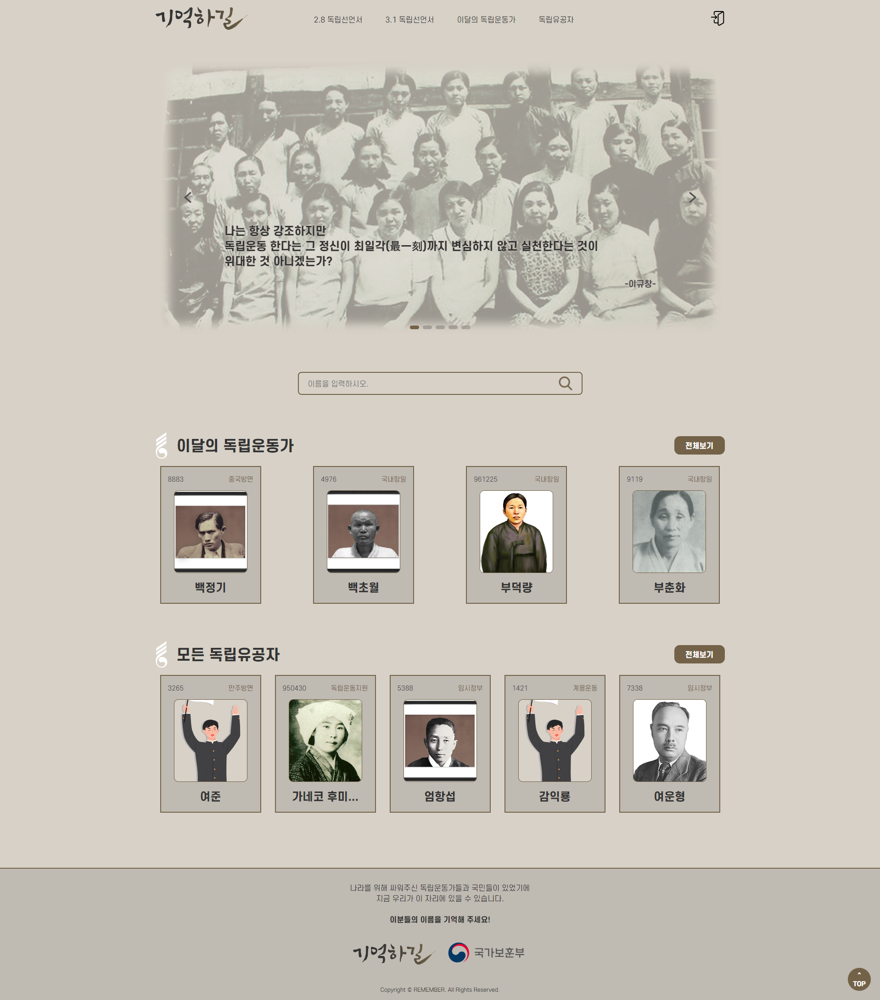|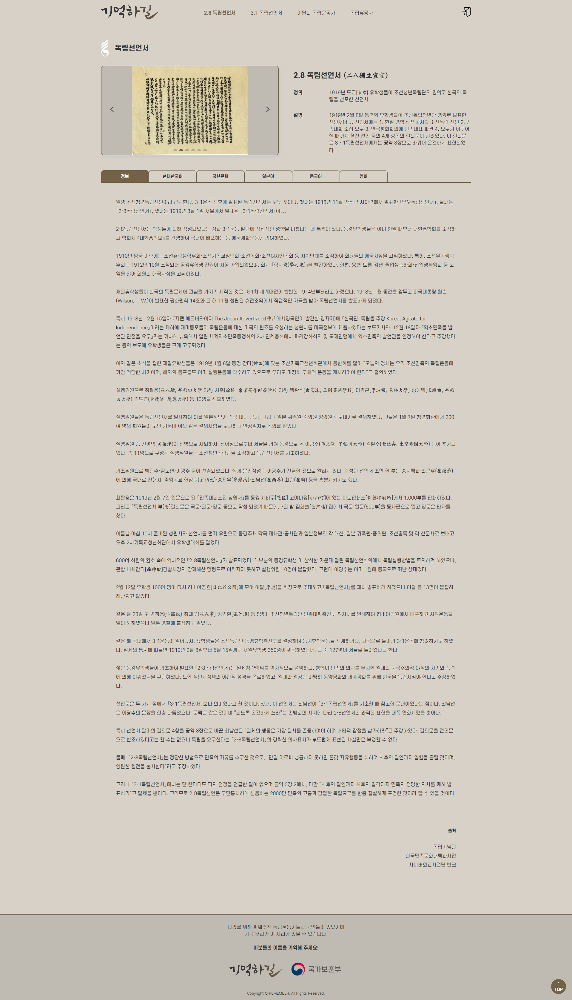|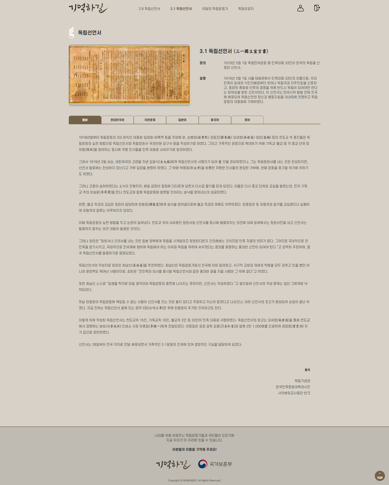 |    

| 로그인 | 회원가입 | 비밀번호찾기 |
| :--: |:-----: |:--------: |
| 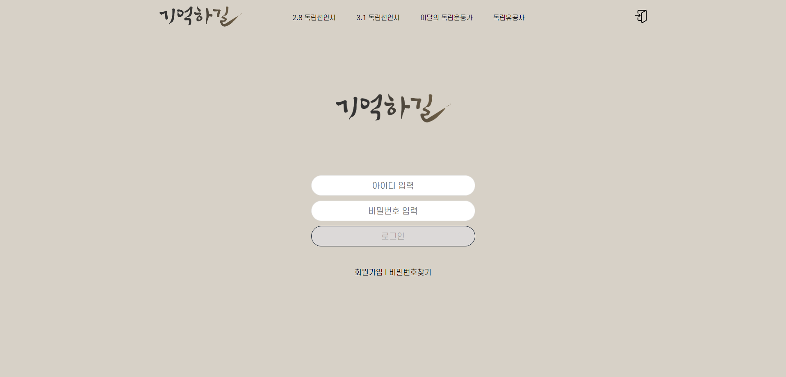|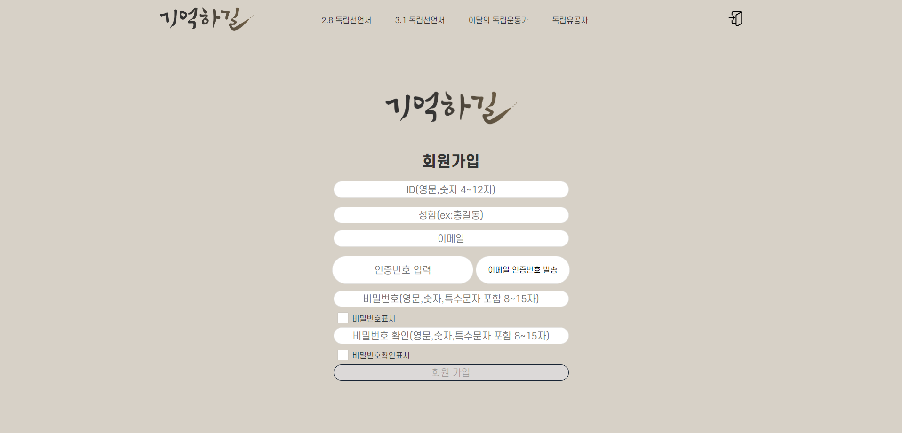|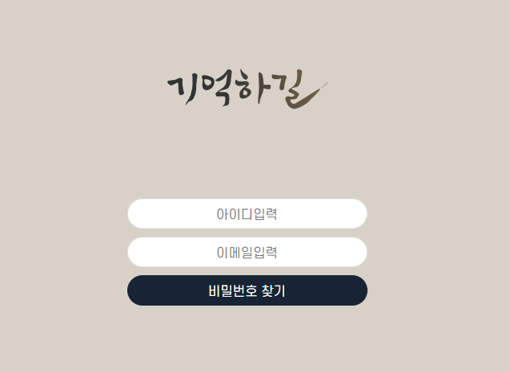 |    

| 모든독립유공자목록 | 이달의독립운동가목록 | 검색목록 |
| :-----------: | :------------: | :----: |
| 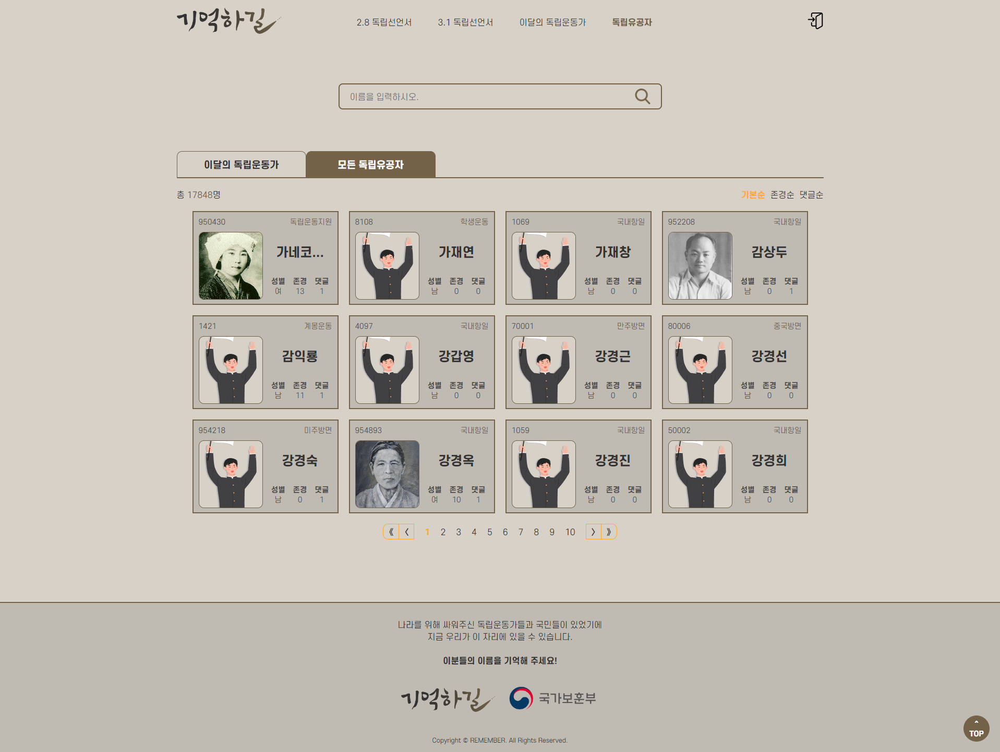|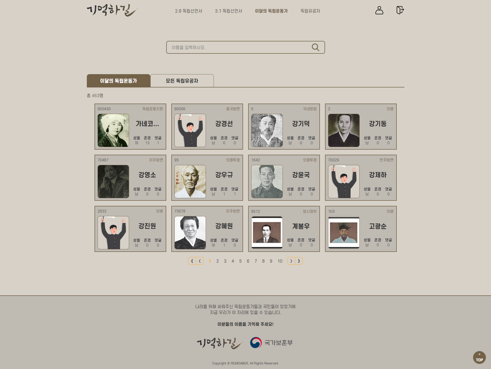|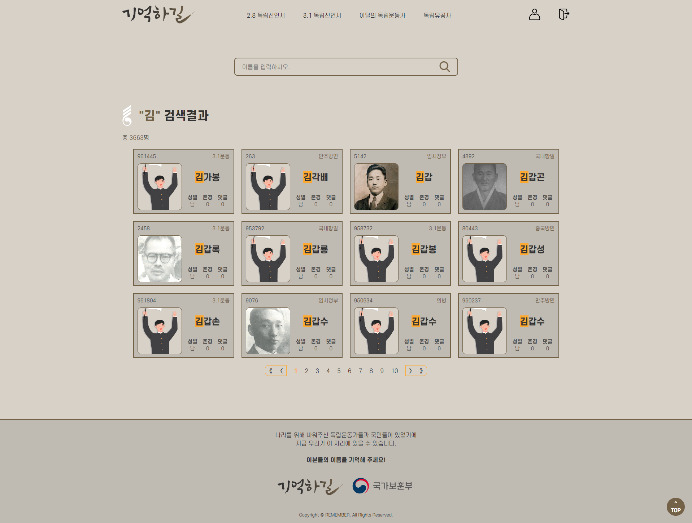 |    

| 공적개요 상세 | 이달의독립운동가 상세 |
| :--------: | :-------------: |
|  |  |    

| 마이페이지 | 마이페이지 작성댓글 | 마이페이지 존경해요 |
| :-----: | :------------: | :------------: |
| 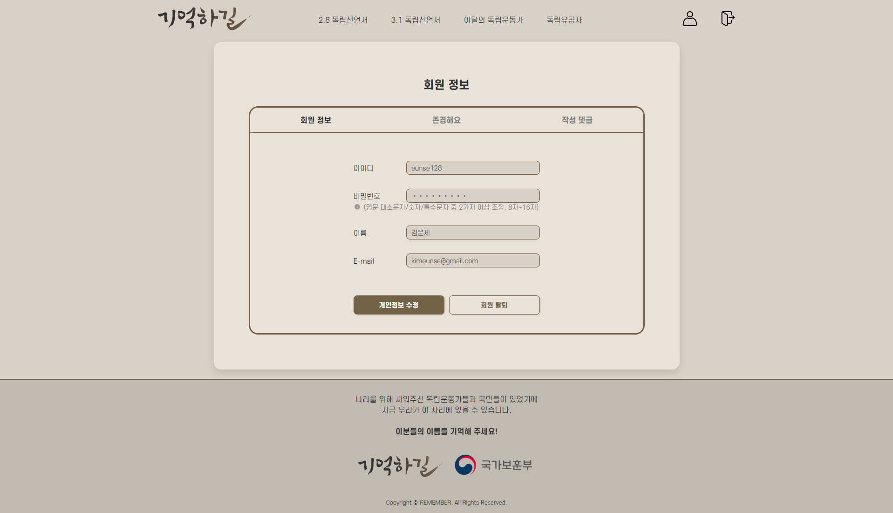 | 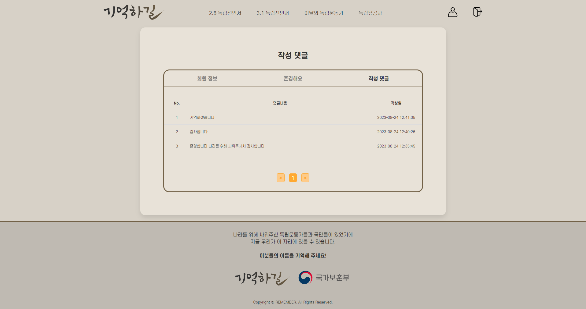 | 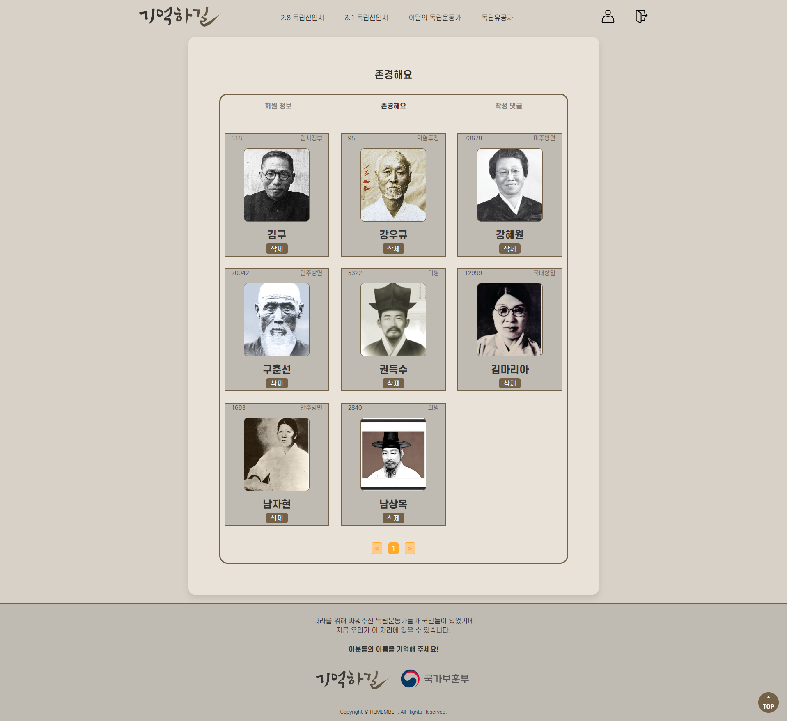 |    

<br /><br />

## 💻 프로젝트 실행 방법

### 환경 변수

<table>
  <tr>
    <td><b>environment</b></td>
    <td><b>description</b></td>
  </tr>
  <tr>
    <td><b>{YOUR_DB_SCHEMA}</b></td>
    <td><b>MY SQL DB Schema 이름을 입력해주세요</b></td>
  </tr>
  <tr>
    <td><b>{YOUR_MYSQL_USERNAME}</b></td>
    <td><b>MY SQL 사용자 이름을 입력해주세요</b></td>
  </tr>
  <tr>
    <td><b>{YOUR_MYSQL_PASSWORD}</b></td>
    <td><b>MY SQL 사용자의 비밀번호를 입력해주세요</b></td>
  </tr>
  <tr>
    <td><b>{YOUR_GOOGLE_EMAIL}}</b></td>
    <td><b>이메일 전송자로 사용할 구글 계정을 입력해주세요</b></td>
  </tr>
  <tr>
    <td><b>{YOUR_GOOGLE_PASSWORD}</b></td>
    <td><b>이메일 전송자로 사용할 구글 계정에 대한 비밀번호를 생성하여 입력해주세요</b></td>
  </tr>
</table>

<br />

#### 1. 레포지토리를 `clone` 합니다

```markdown
$ git clone https://github.com/eunfire/remember.git
```

#### 2. application.properties 파일을 생성합니다

```markdown
spring.mvc.view.prefix=/WEB-INF/views/
spring.mvc.view.suffix=.jsp

spring.datasource.driver-class-name=com.mysql.cj.jdbc.Driver
spring.datasource.url=jdbc:mysql://localhost:3306/{YOUR_DB_SCHEMA}
spring.datasource.username={YOUR_MYSQL_USERNAME}
spring.datasource.password={YOUR_MYSQL_PASSWORD}

mybatis.config-location=classpath:mybatis/mybatis-config.xml
mybatis.mapper-locations=classpath:mybatis/mapper/*-mapping.xml

spring.mail.host=smtp.gmail.com
spring.mail.port=587
spring.mail.username={YOUR_GOOGLE_EMAIL}
spring.mail.password={YOUR_GOOGLE_PASSWORD}
spring.mail.properties.mail.smtp.auth=true
spring.mail.properties.mail.smtp.starttls.enable=true
```

#### 3. 프로젝트를 실행합니다

```markdown
프로젝트 마우스 우 클릭 > Run As > Spring Boot App 클릭
크롬 주소창에 http://localhost:8080 입력
```

<br/>
